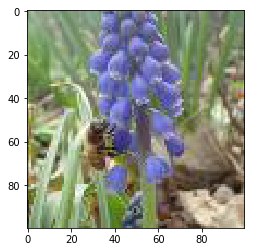
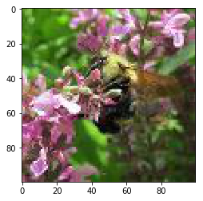
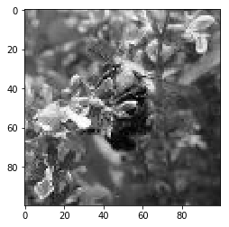
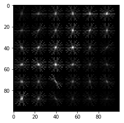
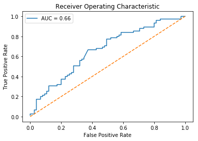

# Introduction
The motivation for this project was to develop a supervised machine learning model to identify whether an image is that of a honey bee or a bumble bee. Support Vector Machine (SVM) was used to classify images.

## 1. Import Python libraries

```python

import os

import matplotlib as mpl
import matplotlib.pyplot as plt
from IPython.display import display
%matplotlib inline

import pandas as pd
import numpy as np

from PIL import Image

from skimage.feature import hog
from skimage.color import rgb2grey

from sklearn.model_selection import train_test_split
from sklearn.metrics import accuracy_score
from sklearn.preprocessing import StandardScaler
from sklearn.decomposition import PCA
from sklearn.svm import SVC

from sklearn.metrics import roc_curve, auc
```

## 2. Display image of each bee type
The file is loaded <code>labels.csv</code> into a dataframe called <code>labels</code>, where the index is the image name and the <code>genus</code> column tells us the bee type. <code>genus</code> takes the value of either <code>0.0</code> (Apis or honey bee) or <code>1.0</code> (Bombus or bumble bee).</p>
<p>The function <code>get_image</code> converts an index value from the dataframe into a file path where the image is located, opens the image using the object in Pillow, and then returns the image as a numpy array.</p>


```python
labels = pd.read_csv("datasets/labels.csv", index_col=0)

labels.head()

def get_image(row_id, root="datasets/"):
    """
    Converts an image number into the file path where the image is located, 
    opens the image, and returns the image as a numpy array.
    """
    filename = "{}.jpg".format(row_id)
    file_path = os.path.join(root, filename)
    img = Image.open(file_path)
    return np.array(img)

# subset the dataframe to just Apis (genus is 0.0) get the value of the sixth item in the index
apis_row = labels[labels.genus == 0.0].index[5]

# show the corresponding image of an Apis
plt.imshow(get_image(apis_row))
plt.show()

# subset the dataframe to just Bombus (genus is 1.0) get the value of the sixth item in the index
bombus_row = labels[labels.genus == 1.0].index[6]

plt.imshow(get_image(bombus_row))
plt.show()
```







## 3. Image manipulation with rgb2grey
<p>Image data is represented as a matrix, where the depth is the number of channels. An RGB image has three channels (red, green, and blue) whereas the returned greyscale image has only one channel. Accordingly, the original color image has the dimensions <code>100x100x3</code> but after calling <code>rgb2grey</code>, the resulting greyscale image has only one channel, making the dimensions <code>100x100x1</code>.</p>

```python
# load a bombus image using our get_image function and bombus_row from the previous cell
bombus = get_image(bombus_row)

print('Color bombus image has shape: ', bombus)

# convert the bombus image to greyscale
grey_bombus = rgb2grey(bombus)

plt.imshow(grey_bombus, cmap=mpl.cm.gray)

print('Greyscale bombus image has shape: ', grey_bombus)
```

    Color bombus image has shape:  [[[103 157  46]
      [ 94 148  37]
      [ 98 152  41]
      ...
      [ 61 120  30]
      [ 69 130  37]
      [ 76 141  41]]
    
     [[ 97 150  42]
      [ 94 147  39]
      [112 165  57]
      ...
      [ 85 120  56]
      [ 78 115  46]
      [ 77 119  45]]
    
     [[ 83 136  30]
      [ 85 138  32]
      [119 175  68]
      ...
      [124 124  96]
      [113 117  84]
      [100 106  68]]
    
     ...
    
     [[161 100 115]
      [151  94 109]
      [105  55  67]
      ...
      [ 31  36  14]
      [ 33  38  16]
      [ 39  44  22]]
    
     [[158  97 113]
      [152  95 110]
      [109  59  71]
      ...
      [ 28  33  11]
      [ 31  36  14]
      [ 39  44  22]]
    
     [[167 106 122]
      [163 106 123]
      [119  68  83]
      ...
      [ 27  32  10]
      [ 30  35  13]
      [ 38  43  21]]]
    Greyscale bombus image has shape:  [[0.53930157 0.50400745 0.51969373 ... 0.39597451 0.43267529 0.4705    ]
     [0.51353216 0.50176745 0.57235569 ... 0.42332588 0.40063765 0.41074353]
     [0.45919569 0.46703882 0.60935412 ... 0.47835765 0.44615961 0.39994196]
     ...
     [0.44723137 0.42036863 0.26074588 ... 0.13078941 0.13863255 0.16216196]
     [0.43574941 0.4242902  0.27643216 ... 0.11902471 0.13078941 0.16216196]
     [0.47104353 0.46799294 0.31340784 ... 0.11510314 0.12686784 0.15824039]]





## 4. Histogram of oriented gradients
<p>The images are converted into a format that a machine learning algorithm can understand. </p>

<p>An image is divided in a grid fashion into cells, and for the pixels within each cell, a histogram of gradient directions is compiled. To improve invariance to highlights and shadows in an image, cells are block normalized, meaning an intensity value is calculated for a larger region of an image called a block and used to contrast normalize all cell-level histograms within each block. The HOG feature vector for the image is the concatenation of these cell-level histograms.</p>


```python
# run HOG using our greyscale bombus image
hog_features, hog_image = hog(grey_bombus,
                              visualize=True,
                              block_norm='L2-Hys',
                              pixels_per_cell=(16, 16))

plt.imshow(hog_image, cmap=mpl.cm.gray)
```


    <matplotlib.image.AxesImage at 0x7f86899bf860>





## 5. Create image features and flatten into a single row
<p>A function called <code>create_features</code> that combines these two sets of features by flattening the three-dimensional array into a one-dimensional (flat) array.</p>


```python
def create_features(img):
    # flatten three channel color image
    color_features = img.flatten()
    # convert image to greyscale
    grey_image = rgb2grey(img)
    # get HOG features from greyscale image
    hog_features = hog(grey_image, block_norm='L2-Hys', pixels_per_cell=(16, 16))
    # combine color and hog features into a single array
    flat_features = np.hstack(color_features)
    return flat_features

bombus_features = create_features(bombus)

print(bombus_features)
```

    [103 157  46 ...  38  43  21]


## 6. Loop over images to preprocess
<p>Above we generated a flattened features array for the bombus image. Now it's time to loop over all of our images. We will create features for each image and then stack the flattened features arrays into a big matrix we can pass into our model.</p>
<p>In the <code>create_feature_matrix</code> function, we'll do the following:</p>
<ul>
<li>Load an image</li>
<li>Generate a row of features using the <code>create_features</code> function above</li>
<li>Stack the rows into a features matrix</li>
</ul>
<p>In the resulting features matrix, rows correspond to images and columns to features.</p>


```python
def create_feature_matrix(label_dataframe):
    features_list = []
    
    for img_id in label_dataframe.index:
        # load image
        img = get_image(img_id)
        # get features for image
        image_features = create_features(img)
        features_list.append(image_features)
        
    # convert list of arrays into a matrix
    feature_matrix = np.array(features_list)
    return feature_matrix

# run create_feature_matrix on our dataframe of images
feature_matrix = create_feature_matrix(labels)
```


## 7. Scale feature matrix + PCA
<p>The dataset have over 31,000 features for each image and only 500 images total. To use an SVM, our model of choice, the number of features needs to be reduced.</p>
<p>PCA is a way of linearly transforming the data such that most of the information in the data is contained within a smaller number of features called components. from an image dataset containing handwritten numbers. The image on the left is the original image with 784 components. We can see that the image on the right (post PCA) captures the shape of the number quite effectively even with only 59 components.</p>


```python
# get shape of feature matrix
print('Feature matrix shape is: ', feature_matrix.shape)

# define standard scaler
ss = StandardScaler()
# run this on our feature matrix
bees_stand = ss.fit_transform(feature_matrix)

pca = PCA(n_components=500)
# use fit_transform to run PCA on our standardized matrix
bees_pca = ss.fit_transform(bees_stand)
# look at new shape
print('PCA matrix shape is: ', bees_pca.shape)
```

    Feature matrix shape is:  (500, 30000)
    PCA matrix shape is:  (500, 30000)


## 8. Split into train and test sets
<p>The data are converted into train and test sets. The training data will inculd 70% of images and the remaining 30% was used to test the model.</p>


```python
X = pd.DataFrame(bees_pca)
y = pd.Series(labels.genus.values)
X_train, X_test, y_train, y_test = train_test_split(X,
                                                    y,
                                                    test_size=.3,
                                                    random_state=1234123)

# look at the distrubution of labels in the train set
pd.Series(y_train).value_counts()
```


    0.0    175
    1.0    175
    dtype: int64


## 9. Train model
<p>To classify as honey or bumble bee -- Support Vector Classifier (SVC), a type of SVM is used. </p>


```python
# define support vector classifier
svm = SVC(kernel='linear', probability=True, random_state=42)

# fit model
svm.fit(X_train, y_train)
```


    SVC(C=1.0, cache_size=200, class_weight=None, coef0=0.0,
      decision_function_shape='ovr', degree=3, gamma='auto', kernel='linear',
      max_iter=-1, probability=True, random_state=42, shrinking=True,
      tol=0.001, verbose=False)


## 10. Score model
<p>Predictions are calculated on the test data, followed by the accuracy. </p>


```python
# generate predictions
y_pred = svm.predict(X_test)

# calculate accuracy
accuracy = accuracy_score(y_test, y_pred)
print('Model accuracy is: ', accuracy)
```

    Model accuracy is:  0.6466666666666666


## 11. ROC curve + AUC
<p>The <code>svm.predict_proba</code> was used to get the probability that <strong>each class</strong> is the true label. The model predicts there is a 64% chance the bee in the image is an Apis. </p>


```python
# predict probabilities for X_test using predict_proba
probabilities = svm.predict_proba(X_test)

# select the probabilities for label 1.0
y_proba = probabilities[:, 1]

# calculate false positive rate and true positive rate at different thresholds
false_positive_rate, true_positive_rate, thresholds = roc_curve(y_test, y_proba, pos_label=1)

# calculate AUC
roc_auc = auc(false_positive_rate, true_positive_rate)

plt.title('Receiver Operating Characteristic')
# plot the false positive rate on the x axis and the true positive rate on the y axis
roc_plot = plt.plot(false_positive_rate,
                    true_positive_rate,
                    label='AUC = {:0.2f}'.format(roc_auc))

plt.legend(loc=0)
plt.plot([0,1], [0,1], ls='--')
plt.ylabel('True Positive Rate')
plt.xlabel('False Positive Rate');
```




